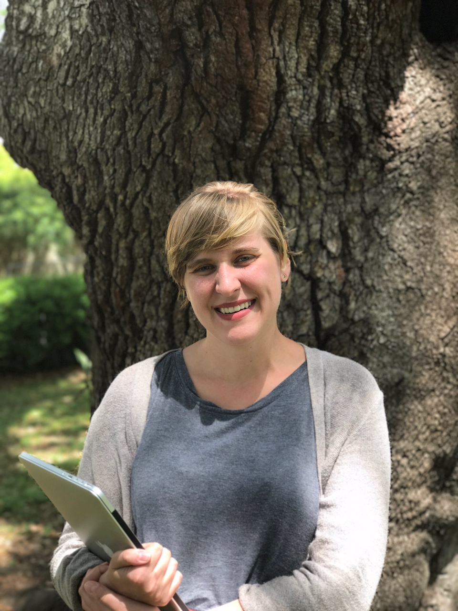

# Sarah Stanley 

Digital Humanities Librarian  Office Of Digital Research and Scholarship  Florida State University  **email**: [scstanley@fsu.edu](mailto:scstanley@fsu.edu)  **GitHub**: [https://github.com/scstanley7](https://github.com/scstanley7)  **Twitter**: [@sarcathtic](https://twitter.com/sarcathtic)  **Website**: [http://scatherinestanley.us](http://scatherinestanley.us)
 **ORCID**: [https://orcid.org/0000-0001-6089-3910](https://orcid.org/0000-0001-6089-3910) 

Hello! My name is Sarah Stanley and I am the Digital Humanities Librarian at Florida State University. I do trainings and consultations on data management for humanists, maintaining a scholarly web presence for yourself and for your research projects, and conducting humanistic inquiry with digital tools.

My particular area of focus is text. I currently serve on the [Text Encoding Initiative](http://www.tei-c.org/index.xml) Technical Council, where I work to maintain the Guidelines. I have worked and consulted on several text encoding projects, including the [Women Writers Project](http://wwp.northeastern.edu) and the [Digital Egyptian Gazette](https://dig-eg-gaz.github.io). 

I also do work with text analysis, mapping, prosopographies, and digital collections. For a full list of projects that I currently work with, please see my [CV](cv).